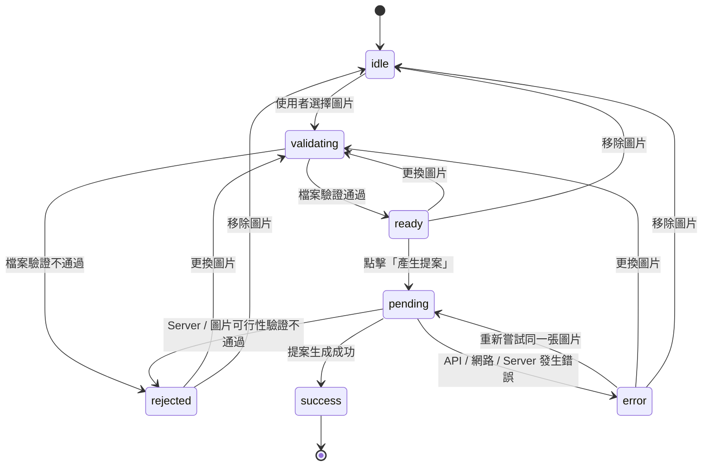

# 提案流程狀態規格

## 1. 目的

本規格定義 EssenceLens 從圖片選取到提案生成的狀態、責任邊界與 API 結果，涵蓋：

- Client 圖片檔案驗證
- Server 提案 pipeline
- Azure Content Safety
- Gemini 圖片理解與提案生成
- UI 狀態顯示
- retry 與 request idempotency

核心原則：只建立一套對 UI 有意義的流程狀態。Server 內部依序執行 pipeline，Provider 以成功回傳或錯誤拋出表示結果，不各自建立公開狀態機。

## 2. 範圍

### 包含

- `idle`、`validating`、`ready`、`pending`、`rejected`、`error`、`success` 的流程狀態。
- Client 與 Server 的驗證邊界。
- `422 rejected`、`5xx error` 的明確區分。
- 同一操作的 `requestId` 與 `idempotencyKey`。
- 以 Nitro `defineCachedFunction` 保存短期 idempotency outcome。
- retry、重複 request 與舊結果清理規則。
- 最小正常與非正常測試情境。

### 不包含

- Azure / Gemini 各自的公開 UI state。
- Provider 中間結果 cache 或從失敗 stage 恢復。
- Proposal polling endpoint。
- request state 的永久保存。
- Redis、資料庫或其他外部 idempotency store。
- 取消進行中的 request。
- 多使用者登入、權限與歷史提案保存。

## 3. 整體流程



`pending` 包含以下 Server pipeline，但不要求 UI 顯示細部 stage：

```text
Server technical validation
  → Azure Content Safety
  → Gemini semantic analysis
  → EssenceLens feasibility policy
  → Gemini proposal generation
```

## 4. State Model

### 4.1 UI Flow State

```ts
type ProposalFlowStatus =
  'idle' | 'validating' | 'ready' | 'pending' | 'rejected' | 'error' | 'success'
```

| State        | 定義                                             | 可用操作                    |
| ------------ | ------------------------------------------------ | --------------------------- |
| `idle`       | 尚未選取圖片，或使用者已移除圖片                 | 選取圖片                    |
| `validating` | 正在執行 Client 檔案驗證                         | 禁止重複選取流程            |
| `ready`      | 圖片已通過 Client 檔案驗證，尚未送出提案 request | 產生提案、更換、移除        |
| `pending`    | Server request 尚未完成                          | 禁止產生、retry、更換與移除 |
| `rejected`   | 圖片明確不符合產品接受條件                       | 查看原因、更換、移除        |
| `error`      | 流程因系統或 Provider 失敗而未完成               | retry、更換、移除           |
| `success`    | 已取得有效提案                                   | 流程結束                    |

`rejected` 時保留可預覽的圖片與 rejection reason；不可對同一張圖片 retry。

`error` retry 時保留同一張圖片，但必須：

1. 清除舊 error。
2. 清除舊 proposal result，避免顯示過期內容。
3. 建立新的 `idempotencyKey`。
4. 進入 `pending`。
5. 禁止在 request 完成前再次送出。

### 4.2 現有 Composable 的責任

現有 `useImageUpload` 保留圖片本身的 local lifecycle：

```text
idle / validating / ready / error
```

現有 `useProposal` 負責提案 request lifecycle：

```text
idle / pending / rejected / error / success
```

整體 `ProposalFlowStatus` 是由上述狀態與錯誤資料推導出的 UI 顯示結果，不另保存第三份可變狀態。頁面或 feature composable 負責 mapping；元件只接收狀態並顯示。

Client 檔案驗證失敗時，整體 UI 顯示 `rejected`；若已有有效預覽，保留原本的 File 與 preview，只更新這次選取的 rejection feedback。

## 5. Rejection 與 Error

### 5.1 Rejection

`rejected` 代表輸入已被正確理解，但圖片不符合產品條件，通常不應透過 retry 解決。

#### Client 端 rejection

- 空檔案。
- 不支援的 MIME type。
- 超過 4 MB。
- 圖片無法解碼。
- 圖片尺寸不符合限制。

Client 已能判斷的檔案 rejection 不送出 Server request。

#### Server 端 rejection

- Server technical validation 失敗。
- Azure 任一安全類別 severity 大於 0。
- Gemini semantic analysis 命中禁止主題。
- 圖片資訊不足、過度模糊或場景無法辨識。

這些結果使用 HTTP `422 Unprocessable Content`，並提供穩定的 reason code。

### 5.2 Error

`error` 代表流程本身未能完成，不表示圖片一定不合格，通常可透過 retry 恢復。

- Azure timeout、網路錯誤或 5xx。
- Gemini timeout、網路錯誤或 5xx。
- Provider response 格式錯誤或 schema validation 失敗。
- Server exception。
- Proposal Generation 失敗。

Provider 或 Server 發生錯誤時，即使 pipeline 必須停止並採 fail-closed，也不應轉成圖片 `rejected`。

## 6. API Contract

### 6.1 Request

```text
POST /api/proposal
Content-Type: multipart/form-data
```

欄位：

| 欄位             | 必填 | 說明                      |
| ---------------- | ---- | ------------------------- |
| `file`           | 是   | 使用者選取的原始圖片 File |
| `idempotencyKey` | 是   | 同一次操作共用的唯一 key  |

Client 不傳送 `previewUrl` 代替原始 File，也不直接呼叫 Azure 或 Gemini。

### 6.2 HTTP 結果

#### `200 success`

```json
{
  "status": "success",
  "requestId": "request-123",
  "proposals": [
    {
      "title": "午後散步與咖啡",
      "description": "到附近街區散步，再找一間安靜的咖啡店休息。"
    },
    {
      "title": "沿街慢慢走",
      "description": "沿著熟悉的街區走一小段，留意平常忽略的細節。"
    },
    {
      "title": "黃昏取景",
      "description": "在日落前找一個安靜的位置，替今天留下畫面。"
    }
  ]
}
```

#### `422 rejected`

`422` 僅用於「request 格式正確，但圖片不符合產品接受條件」。

```json
{
  "status": "rejected",
  "requestId": "request-123",
  "reasons": [
    {
      "category": "safety",
      "code": "sexual"
    }
  ]
}
```

Reason category 至少包含：

```text
technical
safety
theme
information
```

`technical` category 的 code 使用既有 `ImageUploadErrorCode`，例如 `file-too-large` 或 `image-dimensions-invalid`；其他 category 使用圖片可行性規格定義的 reason code。不讓 Client 依賴 Provider 原始 response 或錯誤文字。

#### `400 Bad Request`

用於 request contract 錯誤：

- 缺少 `file`。
- 缺少 `idempotencyKey`。
- multipart 格式錯誤。

這不是圖片被產品政策拒絕。

#### `409 Conflict`

同一 `idempotencyKey` 被重複使用，但 payload fingerprint 不同時回傳 `409`。Server 不回傳第一次操作的結果，也不執行第二個 payload。

#### `5xx error`

用於 Provider、網路或 Server 執行失敗。對外只回傳穩定的錯誤 code 與 `requestId`，不暴露 API key、Provider 原始錯誤或完整 response。

```json
{
  "status": "error",
  "requestId": "request-123",
  "code": "provider-unavailable"
}
```

## 7. Server 與 Provider 責任

### 7.1 Server route

`server/api/proposal.post.ts` 是唯一的產品流程入口，負責：

- 解析與檢查 multipart request。
- 產生 `requestId`。
- 取得並驗證 `idempotencyKey`。
- 呼叫 proposal service。
- 將 service outcome 映射成 HTTP `200`、`400`、`409`、`422` 或 `5xx`。

Route 不直接撰寫 Provider prompt 或處理 Provider response 細節。

### 7.2 Proposal service

圖片可行性流程由既有規劃的 `server/services/image-feasibility.service.ts` 負責。提案流程 service 以它作為圖片可行性檢驗的單一入口，再接續 Proposal Generation。

Proposal service 負責依序協調：

1. 呼叫 `server/services/image-feasibility.service.ts`。
2. 由 image feasibility service 執行 Server technical validation。
3. 呼叫 Azure Content Safety。
4. 呼叫 Gemini semantic analysis。
5. 執行 EssenceLens feasibility policy。
6. Policy accept 後執行 Gemini proposal generation。

Service 不把 Provider 的 `succeeded` 暴露成產品狀態。Provider function resolve 代表該次呼叫成功，reject 代表該次呼叫失敗。

### 7.3 Provider client

Provider client 只負責：

- 使用 private runtime config 初始化官方 SDK。
- 發送 Provider request。
- 將 Provider response 轉換成內部型別。
- 將 Provider 錯誤轉成可分類的 server error。

Provider client 不決定 UI state，也不決定產品 Accept / Reject。

## 8. Retry 與 Idempotency

### 8.1 Identifiers

```text
requestId
  每一次 HTTP request 都是新的值，用於追蹤與 log。

idempotencyKey
  同一次使用者操作共用的值，用於防止重複執行。
```

retry 代表新的使用者操作，因此必須產生新的 `idempotencyKey`，並建立新的 Server pipeline request。

### 8.2 重複 request

同一 `idempotencyKey` 與相同 payload：

- 不重新執行 pipeline。
- 回傳已保存的 outcome。
- 使用新的 `requestId` 回應這一次 HTTP request。

同一 `idempotencyKey` 與不同 payload：

- 回傳 `409 Conflict`。
- 不執行新的 pipeline。

### 8.3 UI request guard

同一頁面流程在 `pending` 期間必須：

- 停用 generate 與 retry。
- 停用更換與移除圖片。
- composable 內保留 in-flight guard。
- 重複觸發直接忽略，不建立第二個 HTTP request。

Server-level idempotency 仍是必要保護，因為 UI guard 無法涵蓋網路重送、頁面重試或其他 Client。

## 9. `defineCachedFunction` 與 MVP 限制

Server pipeline 使用 Nitro `defineCachedFunction`，以 `idempotencyKey` 作為 cache key：

- TTL：600 秒。
- `swr: false`。
- 只保存 normalized outcome，不保存原始圖片、Provider response 或中間分析資料。
- 成功、rejected 與 error outcome 都必須以可保存的結果表示，讓相同 key 能回放相同結果。

`pending` 是目前 request 的執行中狀態，不要求另建 polling endpoint。相同 process 內的同 key 呼叫可共用進行中的 Promise。

MVP 明確接受以下限制：

- `defineCachedFunction` 不是跨 instance 的 atomic distributed lock。
- 跨 instance 的共享行為取決於 Nitro storage 設定。
- 不保存已通過的 Azure / Gemini 中間結果，因此 retry 不跳過 Server pipeline。
- 若未來需要跨 instance 的絕對 at-most-once execution，需增加 lock、共享 storage 與更完整的 request lifecycle；這不在 MVP 範圍內。

這些限制是刻意的簡化，不代表未來可以直接宣稱完全的分散式 idempotency。

## 10. UI 行為

### `ready`

- 顯示圖片預覽、檔名與尺寸。
- 顯示「產生提案」操作。
- 允許更換與移除。

### `pending`

- 保留圖片預覽。
- 隱藏或清除舊 proposal result；不得顯示過期結果。
- 顯示統一文案：「正在分析圖片並產生提案，請稍候。」
- 不顯示 Azure、Gemini 或內部 pipeline stage。
- 禁止重複送出、更換與移除。

### `rejected`

- 保留圖片預覽與 rejection reason。
- 顯示可理解的修正方向。
- 提供「更換圖片」與「移除圖片」。
- 不提供同一張圖片 retry。

### `error`

- 清除或隱藏舊 proposal result。
- 顯示一般化的暫時性錯誤訊息。
- 提供 retry 與更換圖片。
- 不顯示 Provider 原始錯誤。

### 可及性

- `pending` 使用 `aria-busy`。
- 狀態訊息使用 `aria-live`。
- 錯誤與 rejection reason 顯示在相關操作附近。
- 不只使用 toast 傳達唯一錯誤訊息。

## 11. 測試情境

### 正常結果

| Case | 情境                                   | 預期                                         |
| ---- | -------------------------------------- | -------------------------------------------- |
| N-01 | 選取合法圖片                           | `idle → validating → ready`，顯示預覽        |
| N-02 | 點擊產生提案，pipeline 成功            | `ready → pending → success`，顯示 proposal   |
| N-03 | 相同 key 的重複 request                | 不重跑 pipeline，回傳原 outcome              |
| N-04 | error 後 retry                         | 清除 error/result，使用新 key 進入 `pending` |
| N-05 | Azure safe、Gemini 通過、Policy accept | 進入 Proposal Generation 並成功回應          |

### 非正常結果

| Case | 情境                             | 預期                                                                   |
| ---- | -------------------------------- | ---------------------------------------------------------------------- |
| E-01 | Client 檔案驗證失敗              | UI `rejected`，不呼叫 Server                                           |
| E-02 | Server technical validation 失敗 | HTTP `422`，category `technical`                                       |
| E-03 | Azure 非零 severity              | HTTP `422`，category `safety`，不呼叫後續 Gemini / Proposal Generation |
| E-04 | Gemini Policy reject             | HTTP `422`，category `theme` 或 `information`                          |
| E-05 | Azure / Gemini timeout 或 5xx    | HTTP `5xx`，UI `error`，允許 retry                                     |
| E-06 | Provider response schema invalid | HTTP `5xx`，UI `error`，不暴露原始 response                            |
| E-07 | Proposal Generation 失敗         | HTTP `5xx`，UI `error`，retry 建立新 key                               |
| E-08 | 缺少 file 或 idempotencyKey      | HTTP `400`，不視為圖片 rejection                                       |
| E-09 | 同 key、不同 payload             | HTTP `409`，不執行第二個 payload                                       |
| E-10 | pending 期間再次點擊             | 只送出一個 HTTP request                                                |
| E-11 | rejected 後 retry 同一張圖片     | UI 不提供此操作，只能更換圖片                                          |

## 12. 最小案例驗證

外部 Azure 與 Gemini 尚未串接完成前，開發環境的 default Server route 使用 typed mock provider data 進行最小案例驗證。Mock 僅在 development build 注入，不新增 production runtime mock flag；production 仍使用真實 Provider client，未配置或未連線時回傳 `503 provider-unavailable`。Mock 不改變 Server route 與 service 的資料流程。

測試應保留真實的 Server orchestration，僅 mock provider client 或 provider service 的輸入與輸出：

- Azure mock 回傳所有 category severity 為 `0`。
- Gemini semantic mock 回傳符合既有 schema 且通過 Policy 的分析結果。
- Proposal Generation mock 回傳固定 `Proposal`。

第一個可驗證案例只需涵蓋：

```text
合法圖片
  → Client validating
  → ready
  → 點擊產生提案
  → Server pipeline pending
  → mock Azure safe
  → mock Gemini semantic accept
  → mock Proposal Generation success
  → success
```

接著補三個邊界案例：

```text
不合法圖片
  → rejected
  → 不呼叫 Server
```

```text
Provider error
  → error
  → 清除舊結果
  → retry 使用新 idempotencyKey
  → 新 request
```

```text
Azure mock reject
  → 422 rejected
  → 不呼叫 Gemini 或 Proposal Generation
```

```text
相同 idempotencyKey 重複 request
  → 不重跑 mock pipeline
  → 回傳第一次 outcome
```

## 13. Observability 與資料限制

每次 request 至少記錄：

- `requestId`
- pipeline stage
- provider name
- final status
- reason category / code
- latency

`idempotencyKey` 可用於查找暫存 outcome，但不應把原始圖片、API key、完整 Provider response 或完整 OCR 文字寫入 log。

原始圖片只在當次 Server pipeline 使用，不進入 Client 可見的 Provider URL，也不保存為永久資料。

## 14. 驗收條件

- [ ] 圖片選取後依序進入 `validating` 與 `ready`。
- [ ] Client 檔案驗證失敗時顯示 `rejected`，且不呼叫 Server。
- [ ] 點擊產生提案後進入 `pending`，並禁止重複送出。
- [ ] 成功結果進入 `success`。
- [ ] 產品條件不符合時回傳 HTTP `422` 與明確 reason code。
- [ ] Provider / 網路 / Server 失敗時進入 `error`，而不是 `rejected`。
- [ ] `error` retry 會清除舊 error 與 result，並使用新的 `idempotencyKey`。
- [ ] `rejected` 保留圖片預覽與原因，不提供同圖 retry。
- [ ] 相同 key、相同 payload 不重跑 pipeline。
- [ ] 相同 key、不同 payload 回傳 `409 Conflict`。
- [ ] idempotency outcome TTL 為 10 分鐘。
- [ ] 不保存 Azure / Gemini 中間分析結果。
- [ ] Provider credentials 僅存在 private runtime config。
- [ ] UI 不直接呼叫 Azure 或 Gemini。
- [ ] 外部 Provider 尚未串接時，development default route 可使用 mock provider data 驗證 Server pipeline、image feasibility service 與狀態 mapping；production 不使用 mock。

## 15. MVP 後再處理

以下項目刻意不在本規格中展開：

- Redis / DB shared lock。
- 跨 instance 的 absolute at-most-once guarantee。
- Azure / Gemini intermediate result cache。
- Pipeline polling 與背景工作佇列。
- request cancellation。
- 更細的 Provider stage UI。
- 永久保存提案與圖片。

動畫的獨立規格請見 [`proposal-animation.md`](./proposal-animation.md)。

## Commit Message

```text
docs(status): define proposal flow state machine
```
